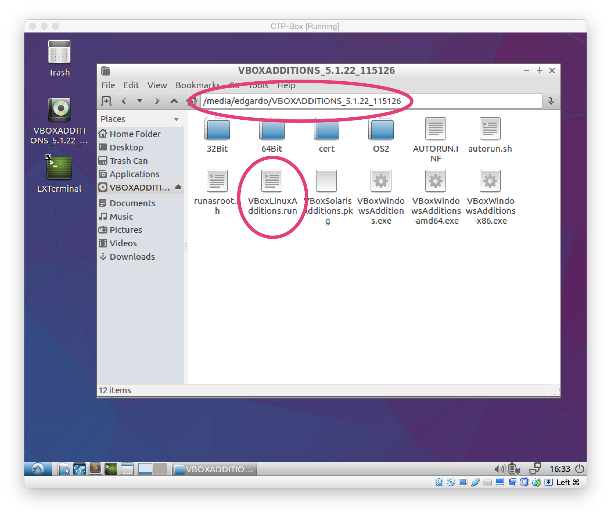

# Installing VirtualBox Guest Additions

After installing your virtual machine you may have noticed that it has a very low resolution and it is not stretching to use your entire displays resolution and space. VirtualBox provides the **Guest Additions** tools to allow guest virtual machines to _auto-resize their display_ dynamically, and they also enable other features like _dragging and dropping_ files and _copying and pasting_ across virtual machines. The steps below will guide you through installing the Guest Addition tools.

- Launch your Virtual Machine
- In the Virtual Box menu select
    + `Devices` > `Insert Guest Additions CD Image`
- This will mount the VBoxAddition Tools CD in your virtual machine. When you open it you should see something like the following:
    + 
- Take note of the folder name (_it will be different from mine_) and the file `VBoxLinuxAdditions.run`. You will need these two to install the tools.
- Open a terminal and change directory into the folder you noted and install the tools as follows:
    + `cd /media/USERNAME/VBOXADDITIONS_5.x.x_yyyyy`
    + `sudo ./VBoxLinuxAdditions.run`
    + 
- Once installation is complete, restart the virtual machine (_do a full Shutdown_). 
- When the virtual machine restarts, it should automatically resize the virtual machine resolution when you stretch the window or go full screen. (Make sure you login)
    + _NOTE:_ If at this point the virtual machine is not resizing, check the `View` menu and verify that the `Auto-resize Guest Display` option is selected.

